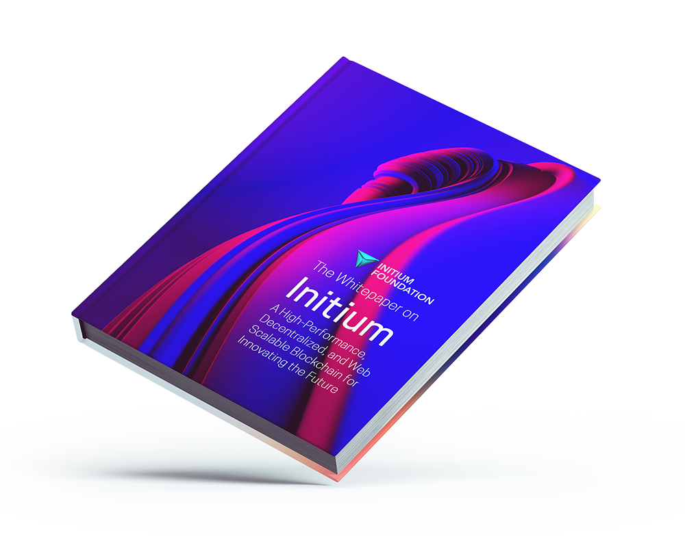

# Abstract

The Initium Foundation releases this whitepaper as a non-profit foundation for developing, maintaining, and promoting the Initium blockchain protocol. This paper discusses the key implementation details, particularly the network design of the Initium blockchain, called Initium and or Initium Network.

The presentation of the Available Information on this whitepaper is solely for informational purposes. This whitepaper is not any financial advice or recommendation and should not be considered any financial advice or investment proposal by any party.

This whitepaper is subject to [disclosure](disclosure.md).&#x20;
