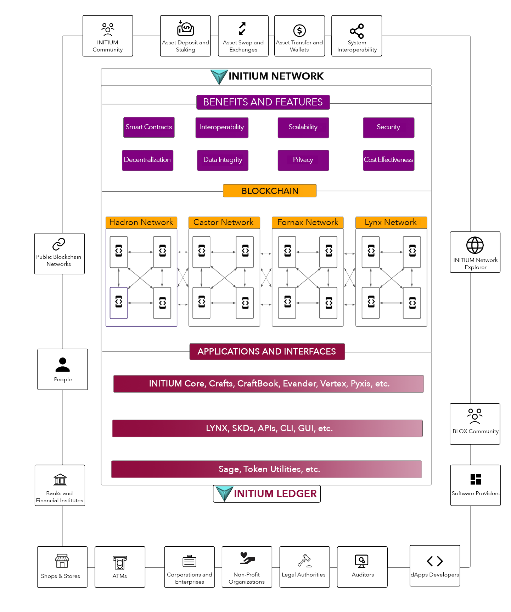

# 3.1 Overview

Initium is a high-performance multi-network blockchain designed for developing highly scalable and secure decentralized applications in DeFi, GameFi, Web 3.0, IoT, BaaS, NFTs, and marketplaces.&#x20;

Every network is designed for specific use cases with different implementations of the Covenant consensus that together build the broader Initium network.&#x20;
