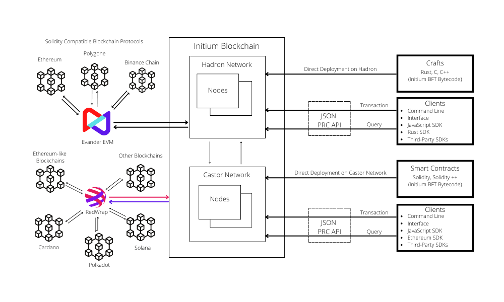
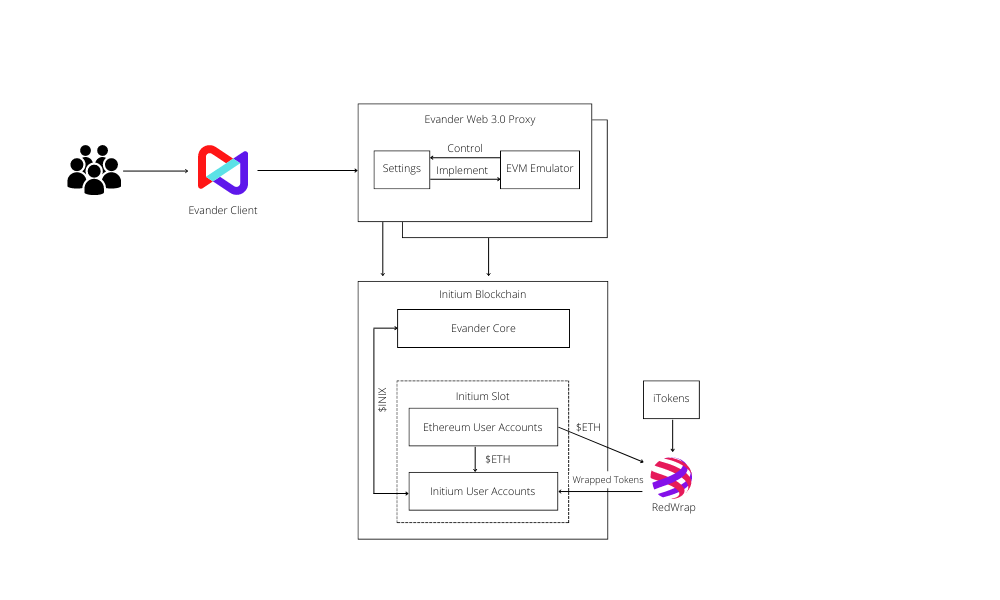

# 3.9 Smart Contracts

We refer to the smart contracts in the Initium terminology as the Initium Crafts (iCrafts). Upon the launch of the Initium protocol, the Hadron and Fornax networks will support the smart contracts (iCrafts) based on the Rust language. We envision that the platform will support a richer and more robust set of iCraft tools, including:

* iCrafts with off-chain execution and on-chain verification.
* Any iCraft that does not operate on the same state in any subnet in Initium will be able to execute in parallel.

Initium smart contract (craft) model differs from traditional EVM-enabled blockchains. Standard EVM-based contract combines code/logic and state into a single contract that is deployed on-chain. In contrast, a smart contract on Initium remains in read-only or stateless mode and contains craft (program) logic only. Once the craft is deployed, it can be accessed by external accounts, and these accounts interact with the iCraft to store the craft interaction-related data. This way, the logical separation of state (accounts) and contract logic (crafts) happens, a significant difference between traditional EVM-enabled and Initium smart contracts. Moreover, accounts on Solana and other blockchains (like Ethereum) are also quite different. Accounts on Initium store data (like wallet information) in contrast to Ethereum accounts that are just the references for users' wallets. In addition, Initium will come with a CLI and JSON RPC API to enhance DApps' interaction with Initium. Moreover, decentralized applications can also use existing SDKs to interact with the blockchain and crafts on Initium.

There are various ways for launching and integrating the digital assets and smart contracts on the other blockchain networks into the Initium blockchain:

* **Castor Network**: to launch such smart contracts, the Initium protocol will introduce the Castor network, an L2 network of the Initium blockchain compatible with Ethereum-like smart contracts. Initium nodes will run this network in parallel with the Hadron network. Transactions on the Castor network follow the same consensus with the Hardron network, and the transaction fees are paid in $INIX. The Castor Bridge rollups the transactions in a single transaction and sends them to the Hadron network for validation. Castor network will come with a CLI and JSON RPC API to enhance DApps' interaction with Initium. Moreover, decentralized applications can also use existing SDKs to interact with the blockchain and crafts on Initium.
* **Evander**: this protocol is designed as an EVM compatible with the Initium Hadron network. Evander is one of the major open-source projects that initium Labs plans to develop as a native solution for Ethereum-like dApps. Evander is an EVM that will allow Ethereum-like transactions to be processed on Initium, taking full advantage of the functionality native to Initium, including the ability to execute transactions in parallel. As such, the Evander EVM allows dApps to operate with the low gas fees, high transaction speed, and high throughput of Initium while offering access to the Initium ecosystem. The Evander will allow any Ethereum application to be run on Initium without any changes to its codebase, including Uniswap, SushiSwap, 0x, and MakerDAO. All essential Ethereum dApp tools can also work on Initium, including Solidity, MetaMask, Remix, and Truffle. The figure below shows the basic design of Evander.

* **RedWrap**: the tokens on the other blockchain platforms, e.g. Ethereum, BSC, Polkadot, Solana, Polygone, Cardano, etc., can easily migrate to the Initium blockchain as the wrapped tokens using the RedWrap blockchain bridge.&#x20;
