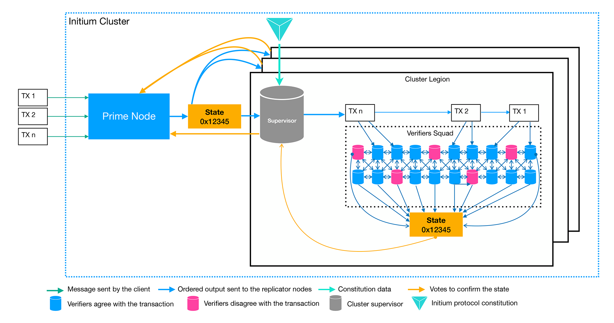

# 4.1 Cluster Overview

Nodes on the Initium blockchain have four statuses: Followers, Candidates, Supervisors, and Prime.&#x20;

* **Follower Nodes**: every node on the Initium follower is primarily a follower node. A follower node contributes to the Initium cluster for verification of transactions, votes for choosing the Prime and Supervisor nodes, and becomes a candidate to be elected as the Prime or Supervisor node.&#x20;
* **Candidate Node**: every node on the Initium blockchain is eligible to be a candidate to be elected by the other nodes for being the Prime or Supervisor.&#x20;

* **Supervisor Node**: a Candidate node that receives the supermajority of votes among the nodes subjected to a legion can become a supervisor node. A Candidate node needs to send a voting request to the neighbor nodes (Squad) and receive the supermajority of votes to be the Supervisor. A Supervisor node and its electing Squad form a Legion together.&#x20;
* **Prime Node**: as the leader of the cluster in the Initium cluster, the prime node is a Candidate that receives the supermajority of the votes from all available nodes in the Initium blockchain. The election of the Prime node occurs before the election of supervisor nodes. The prime node leads the Supervisor nodes. &#x20;

A cluster legion consists of a Supervisor node and its followers that are called Verifiers Squad. Every squad consists of 20 verifiers. By considering the $$n$$ nodes available on the Initium network, a Prime node can lead $$(n-1)/21$$ Legions in a cluster. The Prime node forwards the transactions sent by the clients to the Supervisor nodes. Eventually, the Supervisor nodes control the transaction and their compliance with the Initium Constitution. If the transaction is allowed, then the Supervisor node distributes them on a FIFO basis among the verifiers in the squad. A transaction that is validated by the ⅔ of the Legions will be verified.&#x20;

Initium nodes can join different clusters in different layers of the network, including the Hadron, Castor, and Lynx networks, with different rules depending on their computation power. For this, the node operators need to activate the multi-layer clustering on the Initium Client (the program that connects the verifiers to the Initium network).&#x20;
