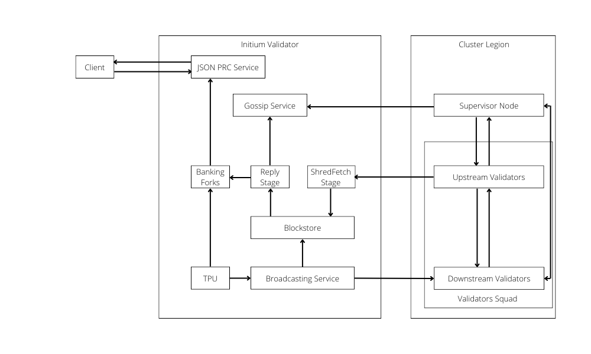
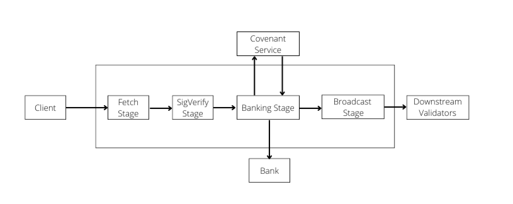
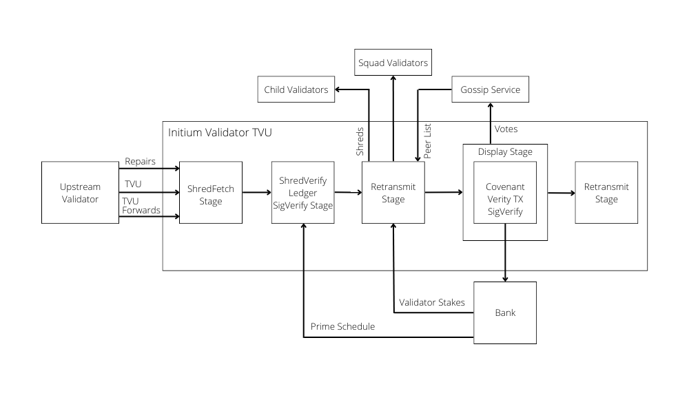

# 4.2 Validators

Also called a "blockchain verifier," validators are computers that maintain the blockchain's integrity by constantly computing the linkage from the first block to the last. There is generally an abbreviated version of the blockchain for this purpose that is much smaller than the full chain, which contains every transaction.

Validators for a public blockchain are maintained primarily by volunteers, who typically dedicate a computer to the process.

### 4.2.1 Pipelining&#x20;

The validators extensively use an optimization standard in CPU design called _pipelining_. Pipelining is the right tool for the job when a stream of input data needs to be processed by a sequence of steps, and there's different hardware responsible for each. The quintessential example is using a washer and dryer to wash/dry/fold several loads of laundry. Washing must occur before drying and drying before folding, but each of the three operations is performed by a separate unit. To maximize efficiency, one creates a pipeline of _stages_. We'll call the washer one stage, the dryer another, and the folding process a third. To run the pipeline, one adds a second load of laundry to the washer just after the first load is added to the dryer. Likewise, the third load is added to the washer after the second is in the dryer, and the first is folded. This way, one can progress on three loads of laundry simultaneously. Given infinite loads, the pipeline will consistently complete a load at the rate of the slowest stage in the pipeline.

### 4.2.2 Pipelining in the Validator

The validator contains two pipelined processes, one used in leader mode called the **TPU** and one used in validator mode called the TVU. In both cases, the pipelined hardware is the same, the network input, the GPU cards, the CPU cores, writes to disk, and the network output. What it does with that hardware is different. The TPU exists to create ledger entries, whereas the TVU exists to validate them.

### 4.2.3 TPU

TPU (Transaction Processing Unit) is the logic of the validator responsible for block production.

Transactions encoded and sent in UDP packets flow into the validator from clients (other validators/users of the network) as follows:

* Fetch stage: allocates packet memory and reads the packet data from the network socket and applies some coalescing of packets received at the same time.
* Sigverify stage: deduplicates packets and applies some load-shedding to remove excessive packets before then filtering packets with invalid signatures by setting the packet's discard flag.
* Banking stage: decides whether to forward, hold or process packets received. Once it detects the node is the block producer. it processes held packets and newly received packets with a Bank at the tip slot.
* Broadcast stage: receives the valid transactions formed into entries from the banking stage and packages them into shreds to send to network peers through the turbine tree structure. Serializes, signs, and generates erasure codes before sending the packets to the appropriate network peer.

### 4.2.4 TVU

TVU (Transaction Verification Unit) is the logic of the validator verifying the block.&#x20;

