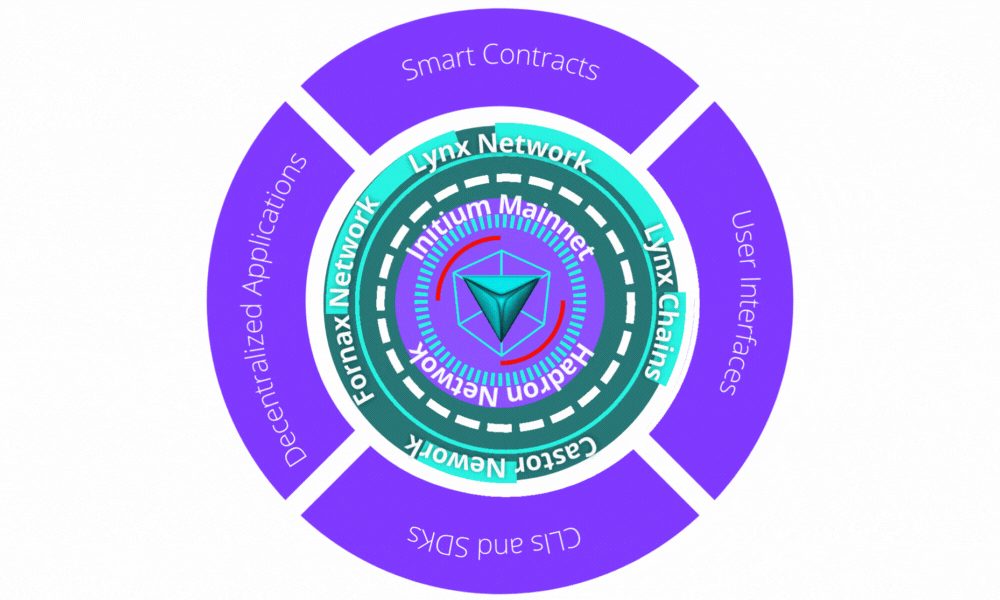

# 1.3 Blockchain Layers

The Initium blockchain is a multi-layered blockchain that enables building an extensive ecosystem. These layers are:

**Layer 0**

Blockchain layer zero is made up of components that help to make blockchain a reality. It's the technology that allows Initium blockchain networks to function. Layer 0 components include the internet, hardware, and connections that will enable layer one to run smoothly.

**Layer one**&#x20;

This is the foundation layer, and its security is based on its immutability. For example, the Ethereum network, or layer one, is what people allude to when they say Ethereum \[[2](../appendixes/references.md)]. This layer is in charge of consensus processes, programming languages, block time, dispute resolution, and the rules and parameters that maintain a blockchain network's basic functionality. It is also known as the implementation layer.&#x20;

**Layer two**&#x20;

The overlapping networks that sit on top of the base layer are known as L2 solutions. Protocols make use of layer two to increase scalability by removing some interactions from the base layer. As a result, smart contracts on the primary blockchain protocol only deal with deposits and withdrawals and ensure that off-chain transactions follow the regulations. Bitcoin's Lightning Network \[[3](../appendixes/references.md)], Polygon \[[4](../appendixes/references.md)], and Optimism \[[5](../appendixes/references.md)] are examples of an L2 blockchain.

So, what is the difference between layer one and layer two blockchains? The blockchain is the first layer in a decentralized ecosystem. Layer two is a third-party integration used in conjunction with layer one to enhance the number of nodes and, as a result, system throughput. Many layer two blockchain technologies are being implemented at present.

**Layer three**&#x20;

The application layer is often referred to as layer three or L3. The L3 projects act as a user interface while masking the technical aspects of the communication channel \[[6](../appendixes/references.md)]. L3 applications are what give blockchains their real-world applicability
